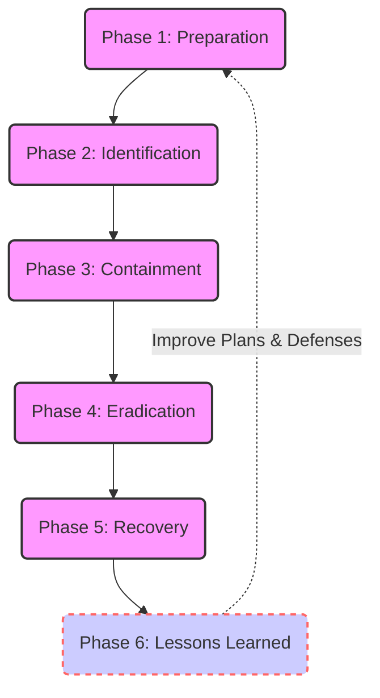

```mermaid
graph TD
    %% Define nodes and their text
    P(Phase 1: Preparation)
    I(Phase 2: Identification)
    C(Phase 3: Containment)
    E(Phase 4: Eradication)
    R(Phase 5: Recovery)
    L(Phase 6: Lessons Learned)

    %% Define connections (the flow)
    P --> I
    I --> C
    C --> E
    E --> R
    R --> L
    
    %% The critical feedback loop back to Preparation
    L -.->|Improve Plans & Defenses| P

    %% Add some styling (optional)
    classDef phase fill:#f9f,stroke:#333,stroke-width:2px;
    classDef loop fill:#ccf,stroke:#f66,stroke-width:2px,stroke-dasharray: 5 5;
    
    class P,I,C,E,R,L phase;
    class L loop;

```